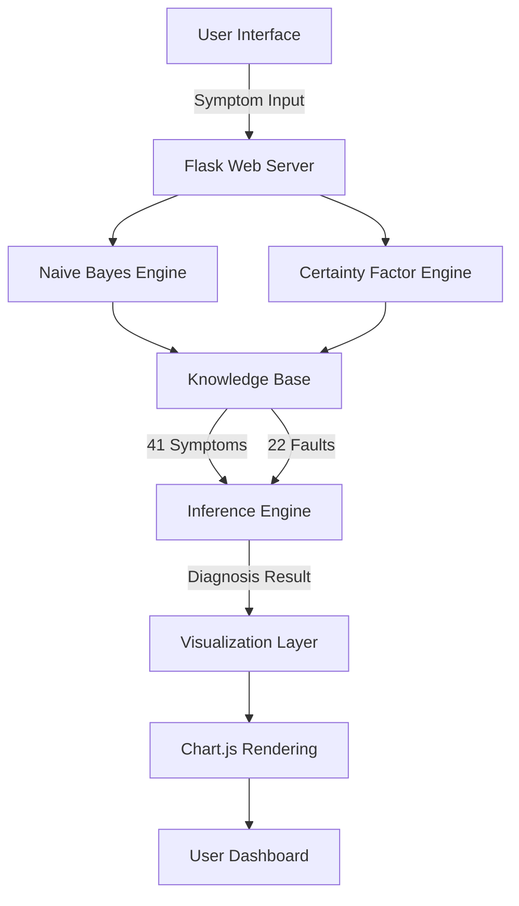

<div align="center">

# 🖥️ Laptop Diagnostic Expert System

### *Intelligent AI-Powered Laptop Troubleshooting Platform*

[](https://www.python.org/)
[](https://flask.palletsprojects.com/)
[](https://tailwindcss.com/)

*Combining Naive Bayes Classification with Certainty Factor Reasoning*

[🚀 Live Demo](#) • [📖 Documentation](#) • [🐛 Report Bug](#) • [✨ Request Feature](#)

---


### **Mengidentifikasi 22 Jenis Kerusakan** | **41 Gejala Terdata** | **Akurasi Tinggi**

</div>

---

## 🎯 Overview

**Laptop Diagnostic Expert System** adalah platform diagnosa kerusakan laptop berbasis kecerdasan buatan yang menggabungkan dua metode powerful: **Naive Bayes Classification** untuk probabilitas kerusakan dan **Certainty Factor** untuk mengukur tingkat keyakinan berdasarkan intensitas gejala.

Dibangun dengan arsitektur modern dan knowledge base komprehensif, sistem ini memberikan diagnosa akurat dalam hitungan detik, membantu teknisi dan end-user mengidentifikasi masalah laptop dengan presisi tinggi.

<br>

<div align="center">

## ✨ Core Features

</div>

<table>
<tr>
<td width="50%">

### 🧠 **Intelligent Diagnosis**
- Hybrid AI: Naive Bayes + Certainty Factor
- 41 symptoms knowledge base
- 22 fault categories detection
- Real-time inference engine
- Multi-symptom correlation analysis

</td>
<td width="50%">

### 📊 **Advanced Analytics**
- Interactive data visualization
- Bar & Pie chart comparison
- Top 3 probable faults ranking
- Confidence level percentage
- Detailed symptom breakdown

</td>
</tr>
<tr>
<td width="50%">

### 🎨 **Premium UI/UX**
- Dark mode glassmorphism design
- Smooth animations & transitions
- Responsive across all devices
- Intuitive navigation system
- Real-time progress tracking

</td>
<td width="50%">

### ⚡ **Performance**
- Lightning-fast diagnosis (<1s)
- Dynamic search & filtering
- Category-based symptom grouping
- Instant result rendering
- Optimized for mobile & desktop

</td>
</tr>
</table>

<br>

---

## 🏗️ Architecture & Technology Stack

<div align="center">



</div>

### 💻 Tech Stack

| Layer | Technology | Purpose |
|-------|-----------|---------|
| **Backend** | Flask 3.0+ | Web framework & routing |
| **AI Engine** | Python 3.8+ | Naive Bayes & CF algorithms |
| **Frontend** | HTML5 + JavaScript | Dynamic UI interactions |
| **Styling** | Tailwind CSS | Modern responsive design |
| **Charts** | Chart.js | Data visualization |
| **Icons** | Bootstrap Icons | UI iconography |
| **Fonts** | Google Fonts (Inter) | Typography system |

<br>

---

## 🚀 Quick Start

### Prerequisites

```bash
Python >= 3.8
pip >= 21.0
Modern web browser (Chrome, Firefox, Safari, Edge)
```

### Installation

```bash
# Clone the repository
git clone https://github.com/yourusername/laptop-diagnosis-expert-system.git
cd laptop-diagnosis-expert-system

# Create virtual environment
python -m venv venv

# Activate virtual environment
# Windows:
venv\Scripts\activate
# Linux/Mac:
source venv/bin/activate

# Install dependencies
pip install flask

# Run the application
python app.py
```

### Access the Application

Navigate to `http://localhost:5000` in your browser.

<br>

---

## 📁 Project Structure

```
laptop-diagnosis-expert-system/
│
├── 📄 app.py                    # Main Flask application
├── 🧠 rules.py                  # AI Engine & Knowledge Base
│
├── 📂 templates/                # Jinja2 HTML Templates
│   ├── base.html               # Base layout template
│   ├── index.html              # Landing page
│   ├── form.html               # Diagnosis input form
│   ├── result.html             # Results dashboard
│   ├── gejala.html             # Symptoms catalog
│   ├── kerusakan.html          # Faults catalog
│   └── tentang.html            # About & methodology
│
├── 📂 static/                   # Static assets (optional)
│   ├── css/                    # Custom stylesheets
│   ├── js/                     # Custom scripts
│   └── images/                 # Image assets
│
├── 📖 README.md                 # This file
├── 📋 requirements.txt          # Python dependencies
└── 📜 LICENSE                   # MIT License
```

<br>

---

## 📚 User Guide

### 🎯 Step-by-Step Diagnosis

<table>
<tr>
<td width="5%">

**1**

</td>
<td>

**Start Diagnosis**

Navigate to the diagnosis page via the main menu or click "Mulai Diagnosa" button

</td>
</tr>
<tr>
<td>

**2**

</td>
<td>

**Select Symptoms**

Choose symptoms your laptop is experiencing from the comprehensive list of 41 symptoms

</td>
</tr>
<tr>
<td>

**3**

</td>
<td>

**Set Intensity Levels**

Rate each symptom's intensity:
- `0` - Not Present
- `0.25` - Rarely
- `0.5` - Occasionally  
- `0.75` - Frequently
- `1.0` - Very Frequently

</td>
</tr>
<tr>
<td>

**4**

</td>
<td>

**Process & Analyze**

Click "Proses Diagnosa" to run the AI inference engine

</td>
</tr>
<tr>
<td>

**5**

</td>
<td>

**Review Results**

Examine the top 3 probable faults with confidence percentages, visualizations, and detailed breakdowns

</td>
</tr>
</table>

### 🔍 Advanced Features

- **Smart Search**: Filter symptoms by keyword in real-time
- **Category Filtering**: Group symptoms by Hardware, Software, BIOS, Power, Display
- **Show Selected**: Toggle view to display only selected symptoms
- **Reset Function**: Clear all selections instantly
- **Progress Tracking**: Visual progress bar showing diagnosis completion

<br>

---

## 🧮 AI Methodology

### Naive Bayes Classification

The system employs **Naive Bayes probabilistic classification** to determine the likelihood of each fault based on observed symptoms.

<div align="center">

```
P(Fault | Symptoms) = P(Symptoms | Fault) × P(Fault) / P(Symptoms)
```

**Where:**
- `P(Fault | Symptoms)` = Probability of fault given symptoms
- `P(Symptoms | Fault)` = Likelihood of symptoms for a fault
- `P(Fault)` = Prior probability of the fault
- `P(Symptoms)` = Marginal probability of symptoms

</div>

**Key Advantages:**
- ⚡ Computationally efficient
- 📊 Excellent for multi-class classification
- 🎯 Handles large feature spaces well
- 💪 Robust with limited training data

### Certainty Factor (CF) Reasoning

**Certainty Factor** quantifies the degree of belief in a diagnosis based on symptom intensity and expert knowledge.

<div align="center">

```
CF_total = CF_expert × Intensity_user

CF_combined = CF₁ + CF₂ × (1 - CF₁)
```

**Where:**
- `CF_expert` = Expert-defined certainty (0.6 - 1.0)
- `Intensity_user` = User-reported symptom intensity (0 - 1.0)
- `CF_combined` = Combined certainty from multiple symptoms

</div>

**Benefits:**
- ✅ Handles uncertainty effectively
- 🔗 Combines evidence from multiple symptoms
- 📈 Provides clear confidence metrics
- 🎓 Based on expert domain knowledge

### Hybrid Approach

Our system leverages **both methodologies in tandem**:

1. **Naive Bayes** provides initial fault probability distribution
2. **Certainty Factor** refines results using symptom intensity
3. **Final ranking** combines both scores for optimal accuracy

<br>

---

## 📊 Knowledge Base Specifications

<div align="center">

| Component | Count | Description |
|-----------|-------|-------------|
| 🔍 **Symptoms** | 41 | Comprehensive laptop fault indicators |
| ⚠️ **Faults** | 22 | Distinct failure categories |
| 📏 **CF Range** | 0.6 - 1.0 | Expert certainty factor values |
| 🔗 **Rules** | 22 | Symptom-to-fault mapping rules |
| 📂 **Categories** | 5 | Hardware, Software, BIOS, Power, Display |

</div>

### Fault Categories

<table>
<tr>
<td width="33%">

**🔧 Hardware Faults**
- LCD Damage
- RAM Failure
- HDD Malfunction
- VGA Card Issues
- Sound Card Problems
- Processor Issues
- Motherboard Failure

</td>
<td width="33%">

**⚡ Power & Battery**
- Adapter/Charger Issues
- Battery Depletion
- CMOS Battery Problems
- Power Cable Damage
- Insufficient Power Supply

</td>
<td width="33%">

**💾 Storage & System**
- OS Corruption
- BIOS Errors
- Application Crashes
- Memory Shortage
- SATA/IDE Cable Issues
- CD/DVD Drive Problems

</td>
</tr>
<tr>
<td width="33%">

**⌨️ Input Devices**
- Keyboard Malfunction
- Touchpad Failure
- USB Device Issues

</td>
<td width="33%">

**🎮 Performance**
- Insufficient RAM
- VGA Memory Shortage
- Low Processor Clock

</td>
<td width="33%">

**🖥️ Display Issues**
- Screen artifacts
- No display output
- Backlight problems

</td>
</tr>
</table>

### Symptom Distribution by Category

```
Hardware ████████████████████ 20 symptoms (48.8%)
Software ████████████ 12 symptoms (29.3%)
BIOS ████ 6 symptoms (14.6%)
Power ████ 7 symptoms (17.1%)
Display ███ 5 symptoms (12.2%)
```

<br>

---

## 🎨 Design Philosophy

Our interface follows **modern design principles** with focus on usability and aesthetics:

### Visual Design
- 🌙 **Dark Mode First**: Reduced eye strain with elegant dark theme
- 💎 **Glassmorphism**: Translucent layers with backdrop blur effects
- 🎨 **Gradient Accents**: Blue-purple gradient scheme for visual hierarchy
- ✨ **Micro-interactions**: Smooth animations on hover and click events

### UX Principles
- 📱 **Mobile-First Responsive**: Optimized for all screen sizes
- ⚡ **Performance**: <1s page load, instant interactions
- ♿ **Accessibility**: WCAG 2.1 compliant, keyboard navigation
- 🎯 **Task-Oriented**: Clear user flow from input to results

### Component Library
```
• Cards with hover lift effects
• Smooth fade-in animations
• Progress bars & counters
• Interactive charts (Bar & Pie)
• Floating action buttons
• Staggered content loading
• Dynamic search & filters
```

<br>

---

## ⚙️ Configuration & Customization

### Environment Variables

Create a `.env` file in the root directory:

```bash
FLASK_APP=app.py
FLASK_ENV=development  # Change to 'production' for deployment
SECRET_KEY=your-secret-key-here
HOST=0.0.0.0
PORT=5000
```

### Custom Configuration

Edit `app.py` to modify settings:

```python
# Change port
app.run(debug=True, port=8080)

# Enable threading
app.run(debug=True, threaded=True)

# Production mode
app.run(debug=False, host='0.0.0.0')
```

### Knowledge Base Customization

Modify `rules.py` to update:
- Add new symptoms to `SYMPTOMS` dict
- Define new faults in `FAULTS` dict
- Update `RULES` for symptom-fault mappings
- Adjust `CF_PAKAR` expert certainty values

<br>

---

## 🐛 Troubleshooting

<details>
<summary><b>Port Already in Use</b></summary>

```bash
# Windows
netstat -ano | findstr :5000
taskkill /PID <process_id> /F

# Linux/Mac
lsof -ti:5000 | xargs kill -9

# Or change port in app.py
python app.py --port 8080
```

</details>

<details>
<summary><b>Module Import Errors</b></summary>

```bash
# Reinstall dependencies
pip install --upgrade flask

# Or use requirements.txt
pip install -r requirements.txt
```

</details>

<details>
<summary><b>Template Not Found Error</b></summary>

Ensure your directory structure matches:
```
project/
├── app.py
├── rules.py
└── templates/
    ├── base.html
    ├── index.html
    └── ...
```

</details>

<details>
<summary><b>Static Files Not Loading</b></summary>

```python
# Verify Flask static folder configuration
app = Flask(__name__, 
            static_folder='static',
            static_url_path='/static')
```

</details>

<br>

---

## 🚀 Deployment

### Deploy to Heroku

```bash
# Create Procfile
echo "web: python app.py" > Procfile

# Create requirements.txt
pip freeze > requirements.txt

# Deploy
heroku create your-app-name
git push heroku main
```

### Deploy to Railway

```bash
# Install Railway CLI
npm i -g @railway/cli

# Login and deploy
railway login
railway init
railway up
```

### Deploy with Docker

```dockerfile
FROM python:3.9-slim
WORKDIR /app
COPY requirements.txt .
RUN pip install -r requirements.txt
COPY . .
EXPOSE 5000
CMD ["python", "app.py"]
```

```bash
docker build -t laptop-diagnosis .
docker run -p 5000:5000 laptop-diagnosis
```

<br>

---

## 🗺️ Roadmap

### Version 1.0 ✅
- [x] Core diagnosis engine (Naive Bayes + CF)
- [x] Web interface with modern UI
- [x] 41 symptoms, 22 faults knowledge base
- [x] Interactive visualizations
- [x] Search & filter functionality

### Version 2.0 🚧
- [ ] **PDF Export**: Generate downloadable diagnosis reports
- [ ] **History Tracking**: Save and review past diagnoses
- [ ] **Multi-language**: English, Indonesian, Mandarin support
- [ ] **API Endpoints**: RESTful API for third-party integration
- [ ] **Mobile App**: Native iOS & Android applications

### Version 3.0 🔮
- [ ] **User Authentication**: Personal accounts with OAuth
- [ ] **Admin Dashboard**: Manage knowledge base via GUI
- [ ] **Machine Learning**: Improve accuracy with ML models
- [ ] **Cloud Integration**: Deploy on AWS/GCP/Azure
- [ ] **Chatbot Interface**: Conversational diagnosis experience

<br>

---

## 🤝 Contributing

We welcome contributions from the community! Here's how you can help:

### Ways to Contribute

- 🐛 **Report Bugs**: Submit detailed bug reports via [Issues](https://github.com/yourusername/laptop-diagnosis/issues)
- ✨ **Feature Requests**: Propose new features or improvements
- 📝 **Documentation**: Improve docs, add examples, fix typos
- 💻 **Code**: Submit pull requests for bug fixes or features
- 🌍 **Translation**: Help translate the interface to other languages

### Development Workflow

```bash
# 1. Fork the repository
# 2. Create your feature branch
git checkout -b feature/AmazingFeature

# 3. Commit your changes
git commit -m 'Add some AmazingFeature'

# 4. Push to the branch
git push origin feature/AmazingFeature

# 5. Open a Pull Request
```

### Code Standards

- Follow PEP 8 style guide for Python
- Write descriptive commit messages
- Add comments for complex logic
- Update documentation for API changes
- Ensure all tests pass before PR

<br>


---


### 🙏 Acknowledgments

Special thanks to:
- [Flask](https://flask.palletsprojects.com/) - Microframework for Python
- [Chart.js](https://www.chartjs.org/) - JavaScript charting library
- [Tailwind CSS](https://tailwindcss.com/) - Utility-first CSS framework
- [Bootstrap Icons](https://icons.getbootstrap.com/) - Open source icon library
- Research papers on expert systems & AI methodologies
- The open source community

</div>

<br>

---

## 📞 Support & Contact

<div align="center">

### Get in Touch

[](mailto:lutfiharyaferdian@gmail.com)
[](https://github.com/yourusername)

### Report Issues

Found a bug? Have a suggestion?
- 🐛 [Report Bug](https://github.com/yourusername/laptop-diagnosis/issues/new?template=bug_report.md)
- ✨ [Request Feature](https://github.com/yourusername/laptop-diagnosis/issues/new?template=feature_request.md)
- 💬 [Join Discussion](https://github.com/yourusername/laptop-diagnosis/discussions)

</div>

<br>

---

<div align="center">

## ⭐ Show Your Support

If this project helped you, please consider giving it a ⭐ star!

<br>

**Made by Lutfi**

*Powered by Flask • Tailwind CSS • AI Technology*

## 📞 Support

Jika ada pertanyaan atau masalah:
- 📧 Email: lutfiharyaferdian@gmail.com
